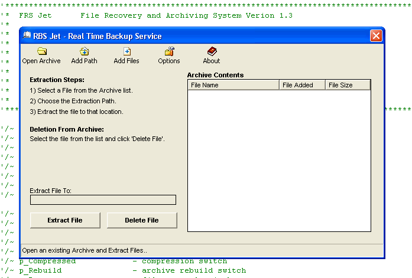



## RBS Jet\! V3\.1 \- RealTime Backup Service

### Description

A true NT service component written in vb. RBS Jet can monitor up to 10 hard drives simultaneously for changes to an unlimited number of specified files, file types, and directories. Backups are performed in real-time.. each time a watched file is changed, the service immediately backs it up to an archive then zips it with api compression. Monitor uses a series of cascading filters to keep cpu footprint negligible.

Supported OS: NT4/W2K/XP/2003.

----

V2 IS Up!

Submitted wrong version of .odl on first go around, (though I think tlb was right one..). Made a couple of fixes here and there..

----

V3 Is Up! Fixed some things in archive and service classes, a couple tweaks here and there.

-Updated path in clsService to 'Service' folder, install problems should be resolved now.

Hope ya like it..

John
 
### More Info
 

             |
---                |---
**Submitted On**   |2006-06-30 08:37:48
**By**             |[Steppenwolfe](https://github.com/Planet-Source-Code/PSCIndex/blob/master/ByAuthor/steppenwolfe.md)
**Level**          |Intermediate
**User Rating**    |5.0 (80 globes from 16 users)
**Compatibility**  |VB 6\.0
**Category**       |[Complete Applications](https://github.com/Planet-Source-Code/PSCIndex/blob/master/ByCategory/complete-applications__1-27.md)
**World**          |[Visual Basic](https://github.com/Planet-Source-Code/PSCIndex/blob/master/ByWorld/visual-basic.md)
**Archive File**   |[RBS\_Jet\!\_V2003596302006\.zip](https://github.com/Planet-Source-Code/steppenwolfe-rbs-jet-v3-1-realtime-backup-service__1-65573/archive/master.zip)

